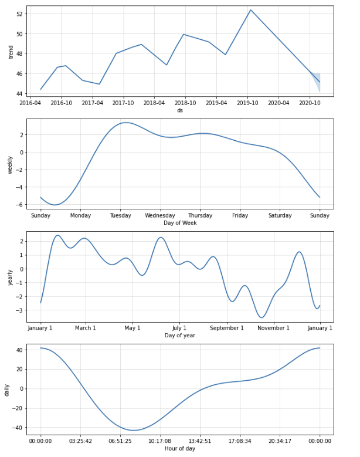

# Forecasting Net with Prophet

* I've been tasked to analyze the company's financial and user data in clever ways to make the company grow. So, I want to find out if the ability to predict search traffic can translate into the ability to successfully trade the stock.

* In a bid to drive revenue, producing a Jupyter notebook that contains the data preparation, analysis, and visualizations for all the time series data that the company needs to understand.

## Technologies

This project was developed with python 3.7 with the following packages:

* [pandas](https://github.com/pandas-dev/pandas) - Providing fast, flexible, and expressive data structures designed to make working with "relational" or "labeled" data both easy and intuitive.

* [HoloViz (formerly PyViz)](https://pypi.org/project/hvplot/) - Data visualization tools hvPlot and GeoView.

* [Holoview](https://holoviews.org) - HoloViews is an open-source Python library designed to make data analysis and visualization seamless and simple. 

* [Prophet](https://pypi.org/project/prophet/) - Prophet is a procedure for forecasting time series data based on an additive model where non-linear trends are fit with yearly, weekly, and daily seasonality, plus holiday effects. 

* [Pystan](https://pystan.readthedocs.io/en/latest/) - PyStan is a Python interface to Stan, a package for Bayesian inference. 


Also, I used [Google Colab](https://colab.research.google.com/) notebook to develope it.

---

## Installation Guide

Before running the application it is necessary to install the following dependencies.

* pandas
```conda install pandas``` 
* Jupyter Notebook
```pip install notebook```
* hvplot
```pip install hvplot```
* holoview
```pip install holoviews```
* Pystan
```pip install pystan```
* Prophet
```pip install prophet```

---

## Usage

To use the application you will need to clone the repo into your machine, navigate on terminal into it and open your [Jupyter Lab](https://github.com/jupyter/notebook) to run the file **forecasting_net_prophet.ipynb**. 

Bellow you can find a brief summary of the data collected through the analysis for the forecasts (daily, weekly, yearly and trend) .
 

---

## Contributors

This was a project developed as a group during a Fintech Bootcamp hosted by UC Berkley Extension. 

---

## License
MIT


HAPPY CODING :) 

